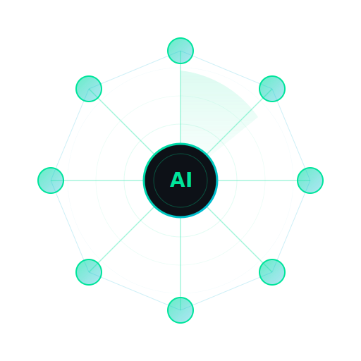

<p align="center">
  
  <h1 align="center">aiscan</h1>
  <p align="center">Agentic Security Scanner — AI-driven reconnaissance meets deterministic scanning</p>
  <p align="center"><strong>Preview — APIs and features may change between releases</strong></p>
</p>

<p align="center">
  <a href="https://github.com/chainreactors/aiscan/releases"></a>
  <a href="https://github.com/chainreactors/aiscan/actions/workflows/ci.yml"></a>
  <a href="https://github.com/chainreactors/aiscan/releases"></a>
  <a href="https://github.com/chainreactors/aiscan/blob/master/LICENSE"></a>
  <a href="https://github.com/chainreactors/aiscan/stargazers"></a>
</p>

<p align="center">
  <a href="README_CN.md">中文文档</a>
</p>

---

**aiscan** combines LLM agents with traditional security scanning engines. Three modes: **Scan** (deterministic pipeline, optional AI assist), **Agent** (natural-language autonomous assessment), **IOA** (multi-agent distributed collaboration).

> **Use only on explicitly authorized targets. Unauthorized use is illegal.**

## Quick Start

```bash
# No LLM needed — one-line scan
aiscan scan -i 192.168.1.0/24

# With LLM — one-line agent
aiscan agent --base-url "https://api.deepseek.com" --api-key "sk-..." --model deepseek-chat \
  -p "scan targets and check for high-risk vulnerabilities" -i 192.168.1.0/24
```

## Install

### Download Binary

From [GitHub Releases](https://github.com/chainreactors/aiscan/releases/latest):

| Edition | Description |
| --- | --- |
| **aiscan** | Standard — scan/agent/gogo/spray/zombie/neutron/arsenal |
| **aiscan-full** | Full — adds playwright browser, passive recon, katana crawler |
| **aiscan-agent** | Lightweight agent runtime, ideal for remote worker deployment |

| OS | Arch | Standard | Full | Agent |
| --- | --- | --- | --- | --- |
| Linux | amd64 / arm64 | `aiscan_linux_amd64` | `aiscan-full_linux_amd64` | `aiscan-agent_linux_amd64` |
| macOS | Intel / Apple Silicon | `aiscan_darwin_amd64` | `aiscan-full_darwin_arm64` | `aiscan-agent_darwin_arm64` |
| Windows | amd64 | `aiscan_windows_amd64.exe` | `aiscan-full_windows_amd64.exe` | `aiscan-agent_windows_amd64.exe` |

```bash
# Linux
curl -L -o aiscan https://github.com/chainreactors/aiscan/releases/latest/download/aiscan_linux_amd64
chmod +x aiscan && sudo mv aiscan /usr/local/bin/

# macOS
curl -L -o aiscan https://github.com/chainreactors/aiscan/releases/latest/download/aiscan_darwin_arm64
chmod +x aiscan && sudo mv aiscan /usr/local/bin/

# Windows (PowerShell)
Invoke-WebRequest "https://github.com/chainreactors/aiscan/releases/latest/download/aiscan_windows_amd64.exe" -OutFile aiscan.exe
```

### Build from Source

```bash
git clone https://github.com/chainreactors/aiscan.git && cd aiscan

go build -o aiscan ./cmd/aiscan                          # standard
go build -tags full -o aiscan-full ./cmd/aiscan           # full (playwright/katana/passive)
```

---

## Features

### Design

- **Single binary, zero dependencies** — statically-linked, drop-in deployment
- **Minimal agent core** — composable ~160-line loop; tools, retries, evaluation are plugged in, not hardcoded
- **Plugin architecture** — adding a new tool is one file; heavy dependencies (playwright, katana) are compile-time optional
- **Embedded skills** — each tool carries its own usage docs and tactical guidance, loaded by the agent on demand
- **Scan + Agent unified** — the same engines drive both the deterministic pipeline and the autonomous agent

### Scan — Deterministic Pipeline

- Multi-stage auto-chaining: port discovery → web probing → weak credentials → POC detection — no LLM required
- Optional AI-driven result verification, public CVE correlation, and dynamic testing
- Quick mode for fast exposure mapping, full mode for deep crawl and extended coverage

### Agent — Autonomous Security Assessment

- Natural language tasks — the agent plans, scans, analyzes, and reports autonomously
- Goal evaluation — an independent evaluator judges task completion and drives automatic retry
- Interactive REPL with direct command execution
- Multi-provider fallback for resilience

### [IOA](https://github.com/chainreactors/ioa) — Multi-Agent Collaboration

- Shared message spaces for distributed agent coordination
- Worker mode for persistent task listening
- Built-in IOA server with token authentication
- See: [Design](https://github.com/chainreactors/ioa/blob/main/docs/design.md) | [CLI](https://github.com/chainreactors/ioa/blob/main/docs/cli.md) | [Extension](https://github.com/chainreactors/ioa/blob/main/docs/extension.md)

### Built-in Toolset

**Scanners**
- [gogo](https://github.com/chainreactors/gogo) — port, service, and banner discovery
- [spray](https://github.com/chainreactors/spray) — web probing, fingerprinting, path fuzzing
- [zombie](https://github.com/chainreactors/zombie) — credential testing
- [neutron](https://github.com/chainreactors/neutron) — template-based POC execution
- [cyberhub](https://github.com/chainreactors/fingers) — fingerprint and POC association query

**Browser & Recon** (full edition)
- playwright — headless Chromium sessions, screenshots, network capture
- katana — web crawler with standard/headless/hybrid engines
- passive — cyberspace search (FOFA, Hunter, Shodan)

**Utilities**
- tmux — background task sessions with incremental output delivery
- arsenal — security tool package manager ([crtm](https://github.com/chainreactors/crtm)), one-command install
- proxy — multi-protocol proxy chain (trojan/vless/anytls/hy2/ss)
- web_search / fetch — CVE search and URL fetching

---

## Usage

### Scan Mode

```bash
aiscan scan -i 192.168.1.0/24                                    # quick scan
aiscan scan -i 192.168.1.0/24 --mode full                        # full scan
aiscan scan -i http://target.example --verify=high --sniper       # AI-enhanced
aiscan scan -i http://target.example --mode full --deep --report  # full + deep + report
```

### Agent Mode

```bash
# One-shot task
aiscan agent -p "scan and find web vulnerabilities" -i 192.168.1.0/24

# With goal evaluation
aiscan agent -p "full scan" -i http://target.example -e "find all open ports with service fingerprints"

# Interactive REPL
aiscan agent
```

### IOA Mode

```bash
# Start IOA server
aiscan ioa serve --ioa-url http://0.0.0.0:8765

# Start IOA worker
aiscan agent --ioa-url http://127.0.0.1:8765 --space pentest-project \
  -p "scan assigned targets and report findings"
```

### LLM Configuration

```bash
# Environment variable
export OPENAI_API_KEY="sk-..."

# CLI arguments
aiscan agent --provider deepseek --base-url https://api.deepseek.com --api-key sk-... --model deepseek-chat
```

Config file `aiscan.yaml`:

```yaml
llm:
  provider: openai
  api_key: sk-...
  model: gpt-4o
```

---

## Documentation

| Doc | Description |
| --- | --- |
| [Scan Mode](docs/scan.md) | Pipeline, AI enhancements, output formats |
| [Agent Mode](docs/agent.md) | Toolset, Goal Evaluation, REPL |
| [IOA](docs/ioa.md) | Multi-agent architecture, Space/Node/Message model |
| [Reference](docs/reference.md) | Configuration, providers, flags, scanner usage, FAQ |
| [Changelog](docs/changelog.md) | Version history |

## Contributing

1. Fork this repository
2. Create a feature branch (`git checkout -b feature/xxx`)
3. Commit your changes (`git commit -m 'feat: add xxx'`)
4. Push to the branch (`git push origin feature/xxx`)
5. Create a Pull Request

## Disclaimer

1. This tool is intended for **authorized security testing and research purposes only**. If you need to test its capabilities, please set up your own lab environment.
2. Before using this tool for any scanning, you must ensure compliance with local laws and regulations and obtain **sufficient authorization. Do not scan unauthorized targets.**
3. If you engage in any illegal activity while using this tool, you shall bear all consequences yourself. We assume no legal or joint liability.
4. Before installing and using this tool, please **carefully read and fully understand all terms**. Limitation and disclaimer clauses may be highlighted for your attention.
5. Unless you have fully read, understood, and accepted all terms of this agreement, please do not install or use this tool. Your use or any other express or implied acceptance constitutes your agreement to be bound by these terms.

## License

This project is licensed under the [GNU Affero General Public License v3.0 (AGPL-3.0)](LICENSE).

## Links

- [chainreactors](https://github.com/chainreactors) — Organization
- [IOA](https://github.com/chainreactors/ioa) — Internet of Agents
- [gogo](https://github.com/chainreactors/gogo) — Port & service discovery
- [spray](https://github.com/chainreactors/spray) — Web probing & fingerprinting
- [zombie](https://github.com/chainreactors/zombie) — Credential testing
- [neutron](https://github.com/chainreactors/neutron) — Template-based POC engine
- [fingers](https://github.com/chainreactors/fingers) — Fingerprint rule engine
- [sdk](https://github.com/chainreactors/sdk) — Scanner SDK (gogo/spray/zombie core)
- [proxyclient](https://github.com/chainreactors/proxyclient) — Multi-protocol proxy client
- [crtm](https://github.com/chainreactors/crtm) — Security tool package registry
- [utils](https://github.com/chainreactors/utils) — Shared utilities & PTY manager
- [parsers](https://github.com/chainreactors/parsers) — Protocol & data parsers

---

<p align="center">
  <a href="https://star-history.com/#chainreactors/aiscan&Date">
    
  </a>
</p>
